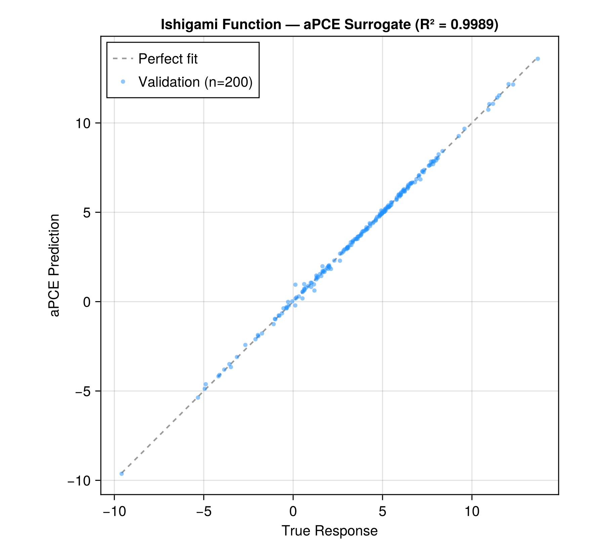
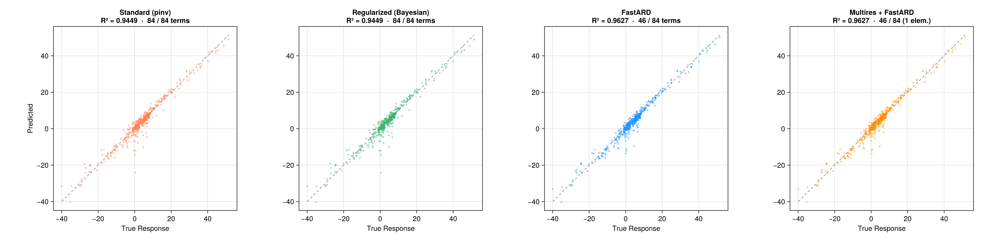
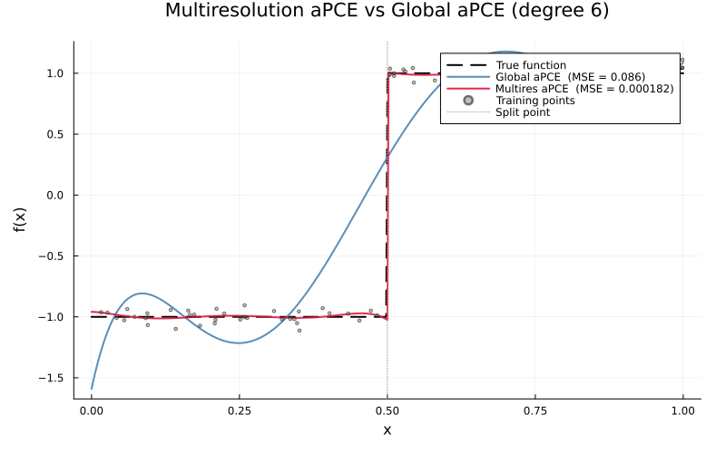

# ArbitraryPolynomialChaosExpansion.jl

[](https://github.com/NilsWildt/ArbitraryPolynomialChaosExpansion.jl/actions/workflows/CI.yml)
[](https://github.com/JuliaTesting/Aqua.jl)
[](https://opensource.org/licenses/MIT)
[](#installation)

> **Note:** This package is **not yet registered** in the Julia General registry.
> Install it directly from GitHub — see [Installation](#installation).

A Julia package for constructing polynomial chaos expansions with arbitrary polynomial bases, enabling uncertainty quantification and surrogate modeling for complex systems.

## Overview

ArbitraryPolynomialChaosExpansion.jl provides efficient tools for:
- **Arbitrary Polynomial Basis Construction**: Create orthonormal or full polynomial bases purely data driven
- **Moment-Based Orthogonalization**: Construct data-driven orthogonal polynomial bases
- **Uncertainty Quantification**: Compute statistical moments and sensitivities
- **Surrogate Modeling**: Build fast-to-evaluate polynomial approximations of expensive simulations
## Features

- Data-driven orthonormal polynomial basis construction
- Support for multivariate polynomial expansions with flexible term selection
- Bayesian regularization for robust coefficient estimation
- Gaussian collocation point selection (Probabilistic Collocation Method)
- AD compatible 

## Installation

This package is not in the General registry yet, so install it from GitHub:

```julia
using Pkg
Pkg.add(url = "https://github.com/NilsWildt/ArbitraryPolynomialChaosExpansion.jl")
```

Or from the Julia REPL package mode:
```julia
] add https://github.com/NilsWildt/ArbitraryPolynomialChaosExpansion.jl
```

## Quick Start

```julia
using ArbitraryPolynomialChaosExpansion
const APCE = ArbitraryPolynomialChaosExpansion

# Generate training data
TrainingInput = rand(100, 2)  # 100 samples, 2 dimensions
TrainingOutput = sin.(TrainingInput[:, 1]) .* cos.(TrainingInput[:, 2])

# Create polynomial chaos expansion
degree = 3
apc = aPCE(TrainingInput, degree; outdim=1, OrthonormalRepresentation=true)

# Train the model
train!(apc, TrainingInput, TrainingOutput; bayesian_inversion=true, reg_order=2)

# Make predictions
TestInput = rand(20, 2)
predictions = predict(apc, TestInput)

# Uncertainty quantification
uq_results = UQ(apc)
println("Output Mean: ", uq_results.OutputMean)
println("Output Variance: ", uq_results.OutputVar)
```

## Results

### Ishigami Function Benchmark

The classic Ishigami function (a = 7, b = 0.1) with 500 training samples and degree-8 expansion achieves near-perfect surrogate accuracy on held-out validation data:

<p align="center">
  
</p>

### Extended Ishigami: Standard, Regularized, FastARD, and Multiresolution

An extended variant (b = 0.5, 5× the standard) with only 300 training samples and a moderate degree-6 basis (84 terms) exposes the difference between solvers. [FastARD.jl](https://github.com/NilsWildt/FastARD.jl) automatically prunes irrelevant basis functions, achieving the best validation R² with a sparse solution. Combining FastARD with the multiresolution basis (`solver = :fastard` in `auto_refine!`) applies per-element sparse Bayesian regression — on this smooth function, auto-refinement correctly detects no benefit from domain decomposition (1 element), matching the global FastARD accuracy:

| Method | R² (val) | Active / Total terms |
|--------|----------|----------------------|
| Standard (pinv) | 0.9449 | 84 / 84 |
| Regularized (Bayesian) | 0.9449 | 84 / 84 |
| FastARD | **0.9627** | **46 / 84** |
| Multires + FastARD | 0.9627 | 46 / 84 (1 element) |

<p align="center">
  
</p>

### Multiresolution Basis (aMR-PC)

For responses with sharp transitions or multimodal behaviour, a single global polynomial basis struggles with Runge-type oscillations. The [multiresolution basis](https://doi.org/10.1016/j.ress.2022.108376) decomposes the input domain into elements, each with its own local orthonormal basis and independent coefficient solve — eliminating cross-domain interference.

On a 1-D step function (degree 6, 80 training points), splitting at the discontinuity dramatically improves prediction accuracy:

| Method | MSE | vs Global |
|--------|-----|-----------|
| Global aPCE (single element) | 8.6 × 10⁻² | — |
| Multires aPCE — manual split (split\_point set at 0.5 manually) | 1.8 × 10⁻⁴ | **470×** |
| Multires aPCE — auto-refine | 4.8 × 10⁻³ | **18×** |

<p align="center">
  
</p>

```julia
# Standard global basis — overshoots near discontinuities
apc_global = aPCE(X, degree; basis = Val(:recurrence))

# Manual split when the discontinuity location is known
apc_mr = aPCE(X, degree; basis = Val(:multires),
              split_dim = 1, split_point = 0.5)
train!(apc_mr, X, y)

# Auto-refine: the algorithm finds the discontinuity itself
apc_auto = aPCE(X, degree; basis = Val(:multires))
auto_refine!(apc_auto, X, y; max_elements = 8)

# Both paths give the same API for prediction and UQ
predict(apc_auto, X_test)
UQ(apc_auto)

# Sobol sensitivity indices via surrogate Monte Carlo (Saltelli estimator)
sobol_indices_multires(apc_auto, X)

# Bootstrap confidence intervals on the Sobol indices
sobol_bootstrap_ci(apc_auto, X, y; n_bootstrap = 200)
```

The auto-refinement loop uses a between-group-variance criterion to select which element and dimension to split, a quantile grid search for the optimal split point, and stops when further splitting yields less than 1% variance improvement. No domain knowledge or manual split points required.

## Usage

### Creating Polynomial Bases

```julia
# Create orthonormal basis (recommended)
x = rand(100, 3)
degree = 4
basis_ortho = create_basis(x, degree; center_data=true)

# Create full/monomial basis
basis_full = create_basis(x, degree, Val(false))
```

### Training with Regularization

```julia
# Basic training
train!(apc, TrainingInput, TrainingOutput)

# Training with Bayesian regularization (recommended for ill-conditioned problems)
train!(apc, TrainingInput, TrainingOutput; 
       bayesian_inversion=true, 
       reg_order=2)  # 0, 1, 2, or 3 for different regularization orders
```

### Advanced: Gaussian Collocation

```julia
# Enable Gaussian collocation during construction
apc = aPCE(TrainingInput, degree; do_gauss=true, outdim=1)

# Generate collocation points
collocation_points = GaussianCollocation(apc; strategy=:PCM)
```

### Customizing Polynomial Terms

```julia
# Control marginal and interaction terms
apc = aPCE(TrainingInput, degree;
           s_marginals=1.0,      # Keep all marginal terms
           s_interactions=0.5,   # Keep 50% of interaction terms
           outdim=1)
```

## API Documentation

### Main Types

- `aPCE`: Main struct for polynomial chaos expansion

### Core Functions

- `aPCE(InputDistribution, ExpansionDegree; ...)`: Constructor for polynomial chaos expansion
- `train!(apc, TrainingInput, TrainingOutput; ...)`: Train expansion coefficients
- `predict(apc, PredictionInput)`: Evaluate expansion at new points
- `UQ(apc)`: Compute uncertainty quantification statistics

### Basis Functions

- `create_basis(x, degree; center_data=true)`: Create polynomial basis
- `aPCE_OrthonormalBasis(Data, Degree, center_data)`: Construct orthonormal basis
- `aPCE_MultivariatePolynomialDegrees(num_dimensions, max_degree, s_marginals, s_interactions)`: Generate polynomial degree indices

### Collocation

- `GaussianCollocation(apc; strategy=:PCM)`: Generate Gaussian quadrature points

## Examples

See the `examples/` directory for comprehensive usage examples:
- `basic_example.jl`: Basic workflow demonstrating the core API
- `ishigami_example.jl`: Classic Ishigami function UQ benchmark with analytical validation
- `ishigami_extended_fastard.jl`: Extended Ishigami variant comparing Standard, Regularized, [FastARD](https://github.com/NilsWildt/FastARD.jl), and Multiresolution+FastARD solvers

## Contributing

Contributions are welcome! Please feel free to submit issues or pull requests.

## License

This project is licensed under the MIT License - see the [LICENSE](LICENSE) file for details.

## References

 S. Oladyshkin and W. Nowak, "Data-Driven Uncertainty Quantification Using the Arbitrary Polynomial Chaos Expansion," Reliab. Eng. Syst. Safety, vol. 106, pp. 179–190, 2012.
 D. Xiu and G. E. Karniadakis, "The Wiener–Askey Polynomial Chaos for Stochastic Differential Equations," SIAM J. Sci. Comput., vol. 24, no. 2, pp. 619–644, 2002.

 N. Wildt, D. M. Tartakovsky, S. Oladyshkin, and W. Nowak, "Code: A Global Approach to ODE Dynamics Learning," J. Mach. Learn. Model. Comput., vol. 7, no. 2, pp. 73–105, 2026. DOI: 10.1615/JMachLearnModelComput.2026062518
Arbitrary Polynomial Chaos & Uncertainty Quantification

 H. Sharma, L. Novak, and M. Shields, "Physics-Constrained Polynomial Chaos Expansion for Scientific Machine Learning and Uncertainty Quantification," Comput. Methods Appl. Mech. Eng., vol. 431, p. 117314, 2024.

 Y. Li, M. Anitescu, O. Roderick, and F. Hickernell, "Orthogonal Bases for Polynomial Regression with Derivative Information in Uncertainty Quantification," Int. J. Uncertainty Quantif., vol. 1, no. 4, pp. 297–320, 2011.
 T. J. Sullivan, Introduction to Uncertainty Quantification. Berlin: Springer, 2015.

